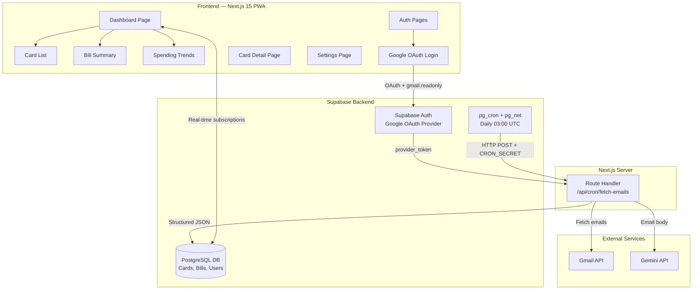

# Credit Card Bill Tracker — Implementation Plan

A mobile-first PWA that automatically fetches credit card statement emails, uses Gemini AI to extract bill details, and presents them in a beautifully designed dashboard with payment tracking.

## User Review Required

> [!IMPORTANT]
> **Google OAuth Scope:** This app will request `gmail.readonly` scope to read the user's emails. Users will see a Google consent screen. You'll need to configure this in Google Cloud Console before deployment.

> [!WARNING]
> **Supabase Project Required:** You'll need an active Supabase project with Edge Functions enabled. The plan assumes you have (or will create) one. Please confirm your Supabase project URL and keys are ready.

> [!IMPORTANT]
> **Gemini API Key:** A Google AI Studio API key is needed for the Gemini integration in the Edge Function. Confirm you have one or plan to create it.

## Open Questions

> [!IMPORTANT]
> 1. **Do you already have a Supabase project set up?** If yes, please share the project URL and anon key (we'll use `.env.local`).
> 2. **Do you have a Google Cloud project with Gmail API enabled?** We need OAuth Client ID + Secret for Supabase Auth.
> 3. **Which Tailwind CSS version do you prefer?** v3 (stable) or v4 (latest)?
> 4. **Email frequency:** How often should the cron job check for new emails? (e.g., every 6 hours, once daily)
> 5. **Multi-currency support?** Should we handle bills in different currencies, or is INR-only sufficient?

---

## Proposed Features (Core + Enhancements)

### Core Features (Your Requirements)
- 📧 **Auto-fetch emails** via Supabase cron → Edge Function → Gmail API
- 🤖 **Gemini AI parsing** of statement emails (bill amount, due date, min payment, card last-4, bank name)
- 💳 **Card management** — Add/fetch credit cards, see card list with beautiful UI
- 📊 **Bill summary** — Per-card bill details with payment status
- 🔗 **Payment link capture** — Extract and store repayment URLs from emails
- 📱 **Mobile-first PWA** — Installable, offline-capable shell
- 🌗 **Light/Dark mode** — Pastel theme with system preference detection

### Enhanced Features (My Suggestions)
- 🔔 **Due date reminders** — Push notifications before bill due dates (via service worker)
- 📈 **Spending trends** — Monthly/quarterly spend visualization per card
- ⚡ **Quick pay** — One-tap redirect to payment links
- 🏷️ **Card tagging** — Categorize cards (Rewards, Cashback, Travel, etc.)
- 🔄 **Manual bill entry** — Fallback for cards not detected via email
- 🛡️ **Bill verification badge** — Visual indicator if Gemini confirmed the email as authentic
- 📋 **Bill history timeline** — Scrollable timeline of past statements per card
- 💰 **Total outstanding** — Aggregate view of all pending bills across cards

---

## Architecture Overview



---

## Tech Stack

| Layer | Technology |
|---|---|
| Framework | Next.js 15 (App Router, TypeScript) |
| Styling | Tailwind CSS v4 + CSS custom properties for theming |
| Auth | Supabase Auth (Google OAuth w/ Gmail scope) |
| Database | Supabase PostgreSQL + Row Level Security |
| Backend Logic | Next.js Route Handlers (Node runtime) |
| Scheduling | Supabase pg_cron + pg_net |
| AI Parsing | Google Gemini API (structured output) |
| PWA | Serwist (service worker + caching) |
| Fonts | Google Fonts — Inter (UI) + JetBrains Mono (numbers) |
| Icons | Lucide React |

---

## Proposed Changes

### 1. Project Scaffold

#### [NEW] Project initialization
```
Credit Card Tracking/
├── app/
│   ├── layout.tsx              # Root layout, fonts, metadata, theme provider
│   ├── manifest.ts             # PWA manifest
│   ├── page.tsx                # Landing/marketing page
│   ├── sw.ts                   # Service worker (Serwist)
│   ├── (auth)/
│   │   ├── login/page.tsx      # Login page
│   │   ├── callback/route.ts   # OAuth callback handler
│   │   └── layout.tsx          # Auth layout (centered card)
│   ├── (dashboard)/
│   │   ├── layout.tsx          # Dashboard shell (nav, header)
│   │   ├── page.tsx            # Dashboard home (overview)
│   │   ├── cards/
│   │   │   ├── page.tsx        # Card list
│   │   │   └── [id]/page.tsx   # Card detail + bill history
│   │   ├── bills/
│   │   │   └── page.tsx        # All bills view
│   │   ├── add-card/
│   │   │   └── page.tsx        # Manual card addition
│   │   └── settings/
│   │       └── page.tsx        # User settings, theme toggle
│   └── api/
│       └── trigger-fetch/
│           └── route.ts        # Manual email fetch trigger
├── components/
│   ├── ui/                     # Reusable primitives
│   │   ├── button.tsx
│   │   ├── card.tsx
│   │   ├── badge.tsx
│   │   ├── input.tsx
│   │   ├── dialog.tsx
│   │   ├── skeleton.tsx
│   │   ├── toast.tsx
│   │   └── toggle.tsx
│   ├── cards/
│   │   ├── credit-card-visual.tsx  # 3D card visualization
│   │   ├── card-list-item.tsx
│   │   └── add-card-form.tsx
│   ├── bills/
│   │   ├── bill-summary-card.tsx
│   │   ├── bill-timeline.tsx
│   │   └── payment-button.tsx
│   ├── dashboard/
│   │   ├── overview-stats.tsx
│   │   ├── spending-chart.tsx
│   │   ├── upcoming-bills.tsx
│   │   └── nav-bar.tsx          # Bottom navigation (mobile)
│   ├── layout/
│   │   ├── theme-provider.tsx
│   │   ├── theme-toggle.tsx
│   │   └── header.tsx
│   └── auth/
│       └── login-form.tsx
├── lib/
│   ├── supabase/
│   │   ├── client.ts            # Browser client
│   │   ├── server.ts            # Server client
│   │   └── middleware.ts        # Session refresh
│   ├── types/
│   │   └── database.ts          # Generated Supabase types
│   └── utils.ts                 # Helpers (cn, formatCurrency, etc.)
├── hooks/
│   ├── use-cards.ts
│   ├── use-bills.ts
│   └── use-theme.ts
├── public/
│   ├── icons/                   # PWA icons (192, 512)
│   └── bank-logos/              # Bank brand assets
├── supabase/
│   ├── migrations/
│   │   └── 001_initial_schema.sql
│   ├── functions/
│   │   ├── fetch-emails/index.ts
│   │   └── parse-statement/index.ts
│   └── seed.sql
├── middleware.ts
├── next.config.ts
├── tailwind.config.ts
├── tsconfig.json
├── package.json
└── .env.local
```

---

### 2. Database Schema

#### [NEW] [001_initial_schema.sql](file:///Users/girishsawant/Desktop/Projects/Credit%20Card%20Tracking/supabase/migrations/001_initial_schema.sql)

```sql
-- Users profile (extends Supabase auth.users)
CREATE TABLE public.profiles (
  id UUID PRIMARY KEY REFERENCES auth.users(id) ON DELETE CASCADE,
  full_name TEXT,
  avatar_url TEXT,
  gmail_connected BOOLEAN DEFAULT false,
  email_last_fetched_at TIMESTAMPTZ,
  notification_preferences JSONB DEFAULT '{"due_date_reminder": true, "new_bill": true}'::jsonb,
  created_at TIMESTAMPTZ DEFAULT NOW(),
  updated_at TIMESTAMPTZ DEFAULT NOW()
);

-- Credit cards
CREATE TABLE public.credit_cards (
  id UUID PRIMARY KEY DEFAULT gen_random_uuid(),
  user_id UUID NOT NULL REFERENCES public.profiles(id) ON DELETE CASCADE,
  bank_name TEXT NOT NULL,
  card_name TEXT,                    -- e.g., "HDFC Regalia", "SBI SimplyCLICK"
  card_network TEXT,                 -- VISA, Mastercard, RuPay, Amex
  last_four_digits TEXT NOT NULL,
  card_type TEXT DEFAULT 'credit',   -- credit, store
  card_color TEXT DEFAULT '#6366f1', -- For visual card UI
  billing_cycle_day INTEGER,         -- Day of month billing cycle starts
  credit_limit NUMERIC(12,2),
  is_active BOOLEAN DEFAULT true,
  tags TEXT[] DEFAULT '{}',          -- ['rewards', 'travel', 'cashback']
  created_at TIMESTAMPTZ DEFAULT NOW(),
  updated_at TIMESTAMPTZ DEFAULT NOW(),
  UNIQUE(user_id, last_four_digits, bank_name)
);

-- Bills / Statements
CREATE TABLE public.bills (
  id UUID PRIMARY KEY DEFAULT gen_random_uuid(),
  card_id UUID NOT NULL REFERENCES public.credit_cards(id) ON DELETE CASCADE,
  user_id UUID NOT NULL REFERENCES public.profiles(id) ON DELETE CASCADE,
  statement_date DATE NOT NULL,
  due_date DATE NOT NULL,
  total_amount NUMERIC(12,2) NOT NULL,
  minimum_payment NUMERIC(12,2),
  previous_balance NUMERIC(12,2),
  payment_status TEXT DEFAULT 'pending',  -- pending, paid, overdue, partial
  payment_link TEXT,                      -- URL to pay
  paid_amount NUMERIC(12,2) DEFAULT 0,
  paid_at TIMESTAMPTZ,
  source_email_id TEXT,              -- Gmail message ID (dedup)
  ai_confidence NUMERIC(3,2),       -- Gemini confidence score 0-1
  ai_verified BOOLEAN DEFAULT false, -- Was Gemini able to verify this?
  raw_email_snippet TEXT,            -- First 500 chars for debugging
  created_at TIMESTAMPTZ DEFAULT NOW(),
  updated_at TIMESTAMPTZ DEFAULT NOW(),
  UNIQUE(card_id, statement_date)
);

-- Email processing log (for dedup + debugging)
CREATE TABLE public.email_log (
  id UUID PRIMARY KEY DEFAULT gen_random_uuid(),
  user_id UUID NOT NULL REFERENCES public.profiles(id) ON DELETE CASCADE,
  gmail_message_id TEXT NOT NULL UNIQUE,
  subject TEXT,
  sender TEXT,
  received_at TIMESTAMPTZ,
  processing_status TEXT DEFAULT 'pending', -- pending, processed, failed, ignored
  processing_result JSONB,
  created_at TIMESTAMPTZ DEFAULT NOW()
);

-- Notifications
CREATE TABLE public.notifications (
  id UUID PRIMARY KEY DEFAULT gen_random_uuid(),
  user_id UUID NOT NULL REFERENCES public.profiles(id) ON DELETE CASCADE,
  title TEXT NOT NULL,
  message TEXT NOT NULL,
  type TEXT DEFAULT 'info',          -- info, warning, success, new_card
  related_bill_id UUID REFERENCES public.bills(id),
  related_card_id UUID REFERENCES public.credit_cards(id),
  is_read BOOLEAN DEFAULT false,
  created_at TIMESTAMPTZ DEFAULT NOW()
);

-- Enable RLS on all tables
ALTER TABLE public.profiles ENABLE ROW LEVEL SECURITY;
ALTER TABLE public.credit_cards ENABLE ROW LEVEL SECURITY;
ALTER TABLE public.bills ENABLE ROW LEVEL SECURITY;
ALTER TABLE public.email_log ENABLE ROW LEVEL SECURITY;
ALTER TABLE public.notifications ENABLE ROW LEVEL SECURITY;

-- RLS Policies: Users can only see their own data
CREATE POLICY "Users can view own profile" ON public.profiles FOR SELECT USING (auth.uid() = id);
CREATE POLICY "Users can update own profile" ON public.profiles FOR UPDATE USING (auth.uid() = id);
CREATE POLICY "Users can view own cards" ON public.credit_cards FOR ALL USING (auth.uid() = user_id);
CREATE POLICY "Users can view own bills" ON public.bills FOR ALL USING (auth.uid() = user_id);
CREATE POLICY "Users can view own email logs" ON public.email_log FOR ALL USING (auth.uid() = user_id);
CREATE POLICY "Users can view own notifications" ON public.notifications FOR ALL USING (auth.uid() = user_id);

-- Indexes for performance
CREATE INDEX idx_cards_user ON public.credit_cards(user_id);
CREATE INDEX idx_bills_card ON public.bills(card_id);
CREATE INDEX idx_bills_user ON public.bills(user_id);
CREATE INDEX idx_bills_due_date ON public.bills(due_date);
CREATE INDEX idx_bills_status ON public.bills(payment_status);
CREATE INDEX idx_notifications_user ON public.notifications(user_id, is_read);
CREATE INDEX idx_email_log_user ON public.email_log(user_id);

-- Auto-update updated_at trigger
CREATE OR REPLACE FUNCTION update_updated_at()
RETURNS TRIGGER AS $$
BEGIN
  NEW.updated_at = NOW();
  RETURN NEW;
END;
$$ LANGUAGE plpgsql;

CREATE TRIGGER update_profiles_updated_at BEFORE UPDATE ON public.profiles
  FOR EACH ROW EXECUTE FUNCTION update_updated_at();
CREATE TRIGGER update_cards_updated_at BEFORE UPDATE ON public.credit_cards
  FOR EACH ROW EXECUTE FUNCTION update_updated_at();
CREATE TRIGGER update_bills_updated_at BEFORE UPDATE ON public.bills
  FOR EACH ROW EXECUTE FUNCTION update_updated_at();

-- pg_cron setup (run in Supabase SQL editor after enabling the extension)
-- SELECT cron.schedule('fetch-emails', '0 */6 * * *',
--   $$SELECT net.http_post(
--     url := 'https://<project>.supabase.co/functions/v1/fetch-emails',
--     headers := '{"Authorization": "Bearer <service_role_key>"}'::jsonb
--   )$$
-- );
```

---

### 3. Supabase Edge Functions

#### [NEW] [fetch-emails/index.ts](file:///Users/girishsawant/Desktop/Projects/Credit%20Card%20Tracking/supabase/functions/fetch-emails/index.ts)

**Purpose:** Triggered by pg_cron every 6 hours. For each user with Gmail connected:
1. Retrieve their `provider_token` from Supabase Auth
2. Query Gmail API for emails matching credit card statement senders
3. Check against `email_log` for dedup
4. For new emails, invoke `parse-statement` function
5. Update `email_last_fetched_at`

**Gmail search query:**
```
subject:(statement OR "credit card" OR "bill generated" OR "amount due") 
from:(alerts@hdfcbank.net OR alerts@icicibank.com OR alerts@axisbank.com OR ...)
newer_than:7d
```

#### [NEW] [parse-statement/index.ts](file:///Users/girishsawant/Desktop/Projects/Credit%20Card%20Tracking/supabase/functions/parse-statement/index.ts)

**Purpose:** Receives an email body, sends it to Gemini with structured output schema:
```typescript
interface ParsedStatement {
  is_credit_card_statement: boolean;  // Gemini verification
  confidence: number;                 // 0-1
  bank_name: string;
  card_last_four: string;
  card_network?: string;
  statement_date: string;             // YYYY-MM-DD
  due_date: string;
  total_amount: number;
  minimum_payment?: number;
  previous_balance?: number;
  payment_link?: string;
}
```

**Logic:**
1. If `is_credit_card_statement` is false → log as `ignored`
2. If card with matching `last_four + bank_name` exists → create bill record
3. If no matching card → auto-create card + create notification ("New card detected: HDFC ****1234")
4. If `payment_link` found → store it in the bill record

---

### 4. Authentication

#### [NEW] [lib/supabase/client.ts](file:///Users/girishsawant/Desktop/Projects/Credit%20Card%20Tracking/lib/supabase/client.ts)
Browser Supabase client using `createBrowserClient` from `@supabase/ssr`.

#### [NEW] [lib/supabase/server.ts](file:///Users/girishsawant/Desktop/Projects/Credit%20Card%20Tracking/lib/supabase/server.ts)
Server Supabase client using `createServerClient` with cookie handling.

#### [NEW] [middleware.ts](file:///Users/girishsawant/Desktop/Projects/Credit%20Card%20Tracking/middleware.ts)
Session refresh middleware using `updateSession`. Protects `/dashboard/*` routes.

#### [NEW] [(auth)/callback/route.ts](file:///Users/girishsawant/Desktop/Projects/Credit%20Card%20Tracking/app/(auth)/callback/route.ts)
Handles the OAuth redirect, exchanges code for session, stores `provider_token`.

---

### 5. Design System & Theming

#### Pastel Color Palette

| Token | Light Mode | Dark Mode |
|---|---|---|
| `--bg-primary` | `#faf9f7` (warm white) | `#1a1a2e` (deep navy) |
| `--bg-secondary` | `#f0eeeb` (soft cream) | `#16213e` (dark blue) |
| `--bg-card` | `#ffffff` | `#1e2a47` |
| `--text-primary` | `#2d2d3f` | `#e8e8f0` |
| `--text-secondary` | `#6b6b80` | `#9b9bb0` |
| `--accent-primary` | `#7c6df0` (soft purple) | `#9d8ff7` |
| `--accent-success` | `#6bcb9a` (mint) | `#7ddba8` |
| `--accent-warning` | `#f0b86e` (peach) | `#f5c97e` |
| `--accent-danger` | `#f07070` (soft coral) | `#f58a8a` |
| `--accent-info` | `#70b8f0` (sky blue) | `#8ac7f5` |

#### Theme Implementation (per modern-web-guidance)
- Use `color-scheme: light dark` on `<meta>` tag
- CSS custom properties on `:root` with `@media (prefers-color-scheme: dark)` fallback
- `light-dark()` function where supported (with `@supports` fallback)
- LocalStorage persistence with inline `<script>` to prevent FOUC
- Two-state toggle: System default ↔ Opposite (not three-state)

---

### 6. Key UI Components

#### Credit Card Visual (`credit-card-visual.tsx`)
- 3D perspective card with glassmorphism effect
- Bank logo, card network icon, last 4 digits
- Gradient background based on `card_color`
- Subtle shine animation on hover/touch
- Tilt effect on mouse move (desktop)

#### Dashboard Overview
- **Stats bar:** Total outstanding, cards count, next due date
- **Upcoming bills:** Horizontal scroll of bill cards sorted by due date
- **Spending chart:** Bar chart of monthly totals (last 6 months)
- **Recent notifications:** New card detections, overdue alerts

#### Bottom Navigation (Mobile)
- 4 tabs: Home, Cards, Bills, Settings
- Active state indicator with smooth animation
- Haptic feedback on supported devices

#### Bill Summary Card
- Card visual mini (bank + last 4)
- Amount due with large typography
- Due date with countdown badge ("3 days left", "Overdue!")
- Payment status pill (Paid ✓, Pending ⏳, Overdue ⚠️)
- "Pay Now" button linking to payment URL

---

### 7. PWA Configuration

#### [NEW] [app/manifest.ts](file:///Users/girishsawant/Desktop/Projects/Credit%20Card%20Tracking/app/manifest.ts)
```typescript
{
  name: 'CardTrack — Credit Card Bill Tracker',
  short_name: 'CardTrack',
  start_url: '/dashboard',
  display: 'standalone',
  background_color: '#faf9f7',
  theme_color: '#7c6df0',
  icons: [/* 192x192, 512x512 */]
}
```

#### Service Worker (Serwist)
- Cache app shell (HTML, CSS, JS) for offline access
- Network-first strategy for API calls
- Stale-while-revalidate for static assets
- Background sync for marking bills as paid when offline

---

## Implementation Phases

### Phase 1 — Foundation (Files 1-15)
1. Initialize Next.js project with TypeScript + Tailwind
2. Set up Supabase clients, middleware, auth flow
3. Create design system (theme provider, CSS tokens, UI primitives)
4. PWA manifest + Serwist setup
5. Login page with Google OAuth

### Phase 2 — Core Features (Files 16-30)
6. Dashboard layout with bottom navigation
7. Credit card visual component
8. Card list page with add card form (manual)
9. Bill summary cards
10. Card detail page with bill history

### Phase 3 — Email Integration (Files 31-38)
11. Database migration (run in Supabase)
12. Edge Function: fetch-emails
13. Edge Function: parse-statement (Gemini)
14. pg_cron scheduling
15. Notification system for new cards / overdue bills

### Phase 4 — Polish (Files 39-45)
16. Spending trends chart
17. Pull-to-refresh on mobile
18. Skeleton loading states
19. Toast notifications
20. Empty states with illustrations
21. Animations and micro-interactions

---

## Verification Plan

### Automated Tests
```bash
# Build verification
npm run build

# Lint
npm run lint

# Type checking
npx tsc --noEmit
```

### Manual Verification
- [ ] PWA installability check via Chrome DevTools → Application tab
- [ ] Dark/light mode toggle works without FOUC
- [ ] Google OAuth login flow completes successfully
- [ ] Responsive layout on iPhone SE (375px), iPhone 15 (393px), iPad (768px)
- [ ] Card addition form validates and saves
- [ ] Edge Functions deploy and process test emails
- [ ] Bill summary renders correctly with mock data
- [ ] Payment link redirect works
- [ ] Offline shell loads when disconnected
